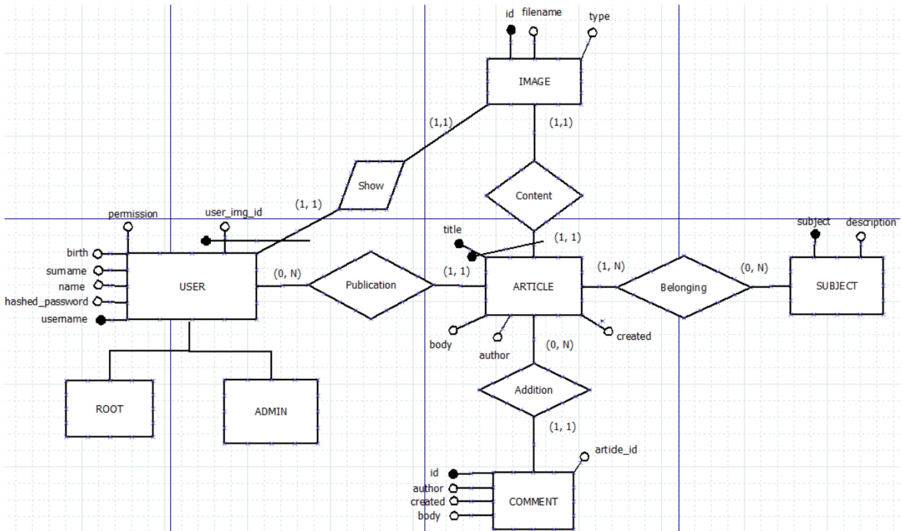

# Progetto di Basi di Dati

## Abstract:

Il progetto implementa un Blog il cui front end è gestito con PHP e il back-end con MYSQL. Il Blog e’ costituito da articoli, identificati da un id e un argomento. E’ possibile per un visitatore commentare. E’ gestito da un massimo di 10 utenti di cui 1 root e gli altri 9 admin. Gli utenti admin avranno la possibilità di creare articoli e argomenti e il root potra’ creare altri utenti.

Le operazioni tipiche sono la pubblicazione di articoli, la visualizzazione di articoli , i commenti agli articoli.

## Analisi Dei Requisiti:

Si vuole realizzare una base di dati che modelli alcune classi appartenenti a un Blog.

Entità progettuali e le relative informazioni:

Gli user sono identificati dall’username e di questi si ha l’username, password, name, surname, birth date, address, l’id profile image, il permission.

In base al valore del campo permission un user e’ generalizzato in root e admin. Esiste un solo user root e al massimo 9 user admin. L’user admin puo’ creare articles e subject e puo’ editare e cancellare i propri articles, ma non quelli degli altri user admin o root. Puo’ editare e cancellare tutti i subject. L’user root puo’ creare articles, subjects e altri user e puo’ editare e cancellare tutti gli articles, subjects o users. Non puo’ cancellare se stesso ma puo’ editarsi.

Gli articles sono identificati dal title e hanno il title, l’id dell’image relativa all’article, il body, l’author (user creatore), la date in cui l’article e’ stato creato, N subject. Ogni articolo ha una e una sola image. Ogni article ha un numero N di comments. Gli articoli sono tutti visualizzabili anche da non utenti nella parte pubblica.

Le images sono identificate da un id e di queste si ha l’id, il filename.
I comments sono identificati da un id, l’author (visitatore anonimo del blog o user), la date di creazione del comment e il body.

I subject sono identificati dal nome del subject e di questi si ha il subject (nome) e una description.
Viene tenuta una tabella che tiene traccia delle queries effettuate piu’ spesso.

## Progettazione Concettuale Database:

### Lista delle Classi

| **Classe**  | **Attributi** | 
| ------------------------- | ------------- |
|  User | <ul><li>username: string (primary key)</li><li>hashed_password: string</li><li>name: string</li><li>surname: string</li><li>birth: date</li><li>address: string</li><li>user_img_id: int</li><li>permission: ENUM('root', 'admin')</li></ul> | 
|  Article | <ul><li>title: string (primary key)</li><li>article_img_id: int</li><li>body: string</li><li>author: string</li><li>created: DATETIME</li><li>subject: string</li></ul> | 
|  Image | <ul><li>id: int</li><li>filename: string</li><li>type: string</li></ul> |
|  Comment |  <ul><li>Id: int</li><li>Author: string</li><li>article_id: int</li><li>created: DATETIME</li><li>body: string</li></ul> |
|  Subject |  <ul><li>Subject: string</li><li>Description: string</li></ul> |
|  Queries |  <ul><li>Id: int</li><li>Name: string</li><li>created: DATETIME</li></ul> |

### Lista Delle Associazioni:

| **Associazione**  | **Molteplicità** | 
| ------------------------- | ------------- |
|  USER-ARTICLE: Publication | <ul><li>Ogni User può pubblicare da 0 a N Articles</li><li>Ogni Article deve essere pubblicato da 1 e 1 solo User</li><li>Molteplicità: (0, N)</li></ul> | 
|  USER-IMAGE: Show | <ul><li>Ogni User deve avere 1 e 1 solo Image</li><li>Ogni Image appartiene a 1 e 1 solo Utente</li><li>Molteplicità: (1, 1)</li></ul> | 
|  ARTICLE-IMAGE: Content | <ul><li>Ogni Article può contenere da 0 a 1 Images</li><li>Ogni Image e’ contenuta in 1 e 1 solo Article</li><li>Molteplicità: (0, 1)</li></ul> |
|  ARTICLE-COMMENT: Addition |  <ul><li>A ogni Article si possono aggiungere da 0 a N comments</li><li>Ogni comment può essere aggiunto a 1 e 1 solo Article</li><li>Molteplicità’: (0, N)</li></ul> |
|  ARTICLE-SUBJECT: Belonging |  <ul><li>Ogni Article può avere da 1 a N subjects</li><li>Ogni subject puo’ appartenere a piu’ Articles</li><li>Molteplicità: (N, N)</li></ul> |

### Diagramma ER:

<p align="center">

</p>

## Progettazione Logica:

### Implementazione Classi:

#### Users

* username: string, PRIMARY KEY
* hashed_password: string, NOT NULL
* name: string, NOT NULL
* surname: string, NOT NULL
* birth: date, NOT NULL
* address: string, NOT NULL
* user_img_id: int, NOT NULL
* permission: enum(‘root’,’admin’), NOT NULL

#### ARTICLES:

* title: string, PRIMARY KEY
* article_img_id: int, NOT NULL
* body: string, NOT NULL
* author: string, NOT NULL
* created: date, NOT NULL

#### BELONGING:

* article_id: string, PRIMARY KEY
* subject: string, PRIMARY KEY

#### SUBJECTS:

* subject: string, PRIMARY KEY
* description: string, NOT NULL

#### IMAGES:

* id: int, PRIMARY KEY
* filename: string, NOT NULL
* type: string, NOT NULL

#### COMMENTS:

* id: int, PRIMARY KEY
* author: string, NOT NULL
* article_id: int, NOT NULL
* created: date, NOT NULL
* body: string, NOT NULL

#### QUERIES:

* id: int, PRIMARY KEY
* name: string, NOT NULL
* created: date, NOT NULL

### Implementazione della Base di Dati:

Di seguito viene riportato il codice SQL che è stato utilizzato per implementare le
classi, le relazioni e le gerarchie del DataBase in base a quanto è stato descritto fino ad ora:

```
DROP TABLE IF EXISTS users;
DROP TABLE IF EXISTS belonging;
DROP TABLE IF EXISTS subjects;
DROP TABLE IF EXISTS images;
DROP TABLE IF EXISTS articles;
DROP TABLE IF EXISTS comments;
DROP TABLE IF EXISTS queries;

CREATE TABLE users (
	username VARCHAR(50) NOT NULL,
	hashed_password VARCHAR(60) NOT NULL,
	name VARCHAR(50) NOT NULL,
	surname VARCHAR(50) NOT NULL,
	birth VARCHAR(50) NOT NULL,
	address VARCHAR(50) NOT NULL,
	user_img_id VARCHAR(20) NOT NULL,
	permission VARCHAR(20) NOT NULL,
	PRIMARY KEY(username)
) ENGINE=InnoDB;
	
CREATE TABLE articles (
 	
	title VARCHAR(60) NOT NULL PRIMARY KEY,
	article_img_id INT(11) references images(id),
	body TEXT NOT NULL,
	author VARCHAR(40) NOT NULL references users(username),
	created DATETIME NOT NULL
) ENGINE=InnoDB;

CREATE TABLE subjects (
	subject VARCHAR(30) NOT NULL PRIMARY KEY,
	description TEXT NOT NULL
) ENGINE=InnoDB;

CREATE TABLE belonging (
       article_id VARCHAR(60) NOT NULL references articles(title),
       subject VARCHAR(40) NOT NULL references subjects(subject),
       PRIMARY KEY(article_id, subject)      
) ENGINE=InnoDB;

CREATE TABLE images (
	id INT(11) NOT NULL AUTO_INCREMENT PRIMARY KEY,
	filename VARCHAR(60) NOT NULL,
	type VARCHAR(40) NOT NULL
) ENGINE=InnoDB;

CREATE TABLE comments (
	id INT(11) NOT NULL AUTO_INCREMENT PRIMARY KEY,
	author VARCHAR(255) NOT NULL,
	article_id VARCHAR(60) NOT NULL references articles(title),
	created DATETIME NOT NULL,
	body TEXT NOT NULL
) ENGINE=InnoDB;

create table queries (
       id INT(11) NOT NULL AUTO_INCREMENT PRIMARY KEY,
       name ENUM('create_article', 'view_article', 'comment_article', 'login', 'new_user', 'delete_user') NOT NULL,
       created DATE NOT NULL
) ENGINE=InnoDB;
```

#### Query

Trovare l'anno dell'articolo piu' vecchio pubblicato

```
SELECT min(year(A.created)) as anno_min FROM articles as A
```

Trovare tutti gli articoli scritti da X, di subject Y, nel mese XX, anno YY

```
select DISTINCT A.*, B.subject from (select * from articles where author="X")
as A, belonging as B WHERE B.subject="Y" AND A.title = B.article_id
AND month(created) = XX AND year(created) = YY
```

Trovare quante query si sono effettuate nel mese corrente per ciascun tipo di query

```
select Q.name, count(Q.id) from queries as Q WHERE month(created) = month(CURDATE()) group by Q.name
```

Trovare i 5 articoli piu' commentati nel mese corrente (hanno tanti commenti pubblicati il mese corrente)

```
select A.*, count(C.id) AS commenti_tot, "12" as mese_corrente from articles as A, comments as C
where A.title = C.article_id and month(C.created) = "12" group by A.title ORDER BY commenti_tot DESC LIMIT 5
```

Trovare il subject piu' usato dall'utente X

```
select Z.subject, max(quanto_usato) from (select B.subject, count(B.subject) AS quanto_usato
from (select * from articles where author="X") as A, belonging as B
where A.title = B.article_id group by A.title) as Z
```
Trovare gli articoli pubblicati nel mese XX(corrente default) anno YYYY(corrente default) da ciascun utente

```
SELECT A.author, XX AS mese_corrente, YYYY AS anno_corrente, count(A.title)
as articoli_scritti from articles as A WHERE month(created) = XX AND year(created) = YYYY
group by A.author
```


#### Funzioni

Aggiunge un utente e ritorna true, ma solo se utenti_totali < 10, altrimenti impedisce l'aggiunta e ritorna false

```
DROP FUNCTION IF EXISTS adduser;
DELIMITER |
CREATE FUNCTION adduser(username CHAR(30), hashed_password CHAR(60), name CHAR(20), surname CHAR(20), birth date, address CHAR(30), user_img_id INT, permission ENUM('root', 'admin')) RETURNS BOOL
BEGIN
DECLARE n_users INT;
DECLARE ok BOOL;
SELECT COUNT(*) INTO n_users FROM users;
IF(n_users < 10) THEN
INSERT INTO users (username, hashed_password, name, surname, birth, address, user_img_id, permission) VALUES
(username, hashed_password, name, surname, birth, address, user_img_id, permission);
SET ok = 1;
ELSE
SET ok = 0;
END IF;
RETURN ok;
END |
DELIMITER ;
```

Cancella un Subject e ritorna true, ma solo se non e' stato scritto alcun articolo con quel subject, altrimenti ritorna false

```
DROP FUNCTION IF EXISTS deletesubject;
DELIMITER |
CREATE FUNCTION deletesubject(sub CHAR(30)) RETURNS BOOL
BEGIN
DECLARE n_used INT;
DECLARE ok BOOL;
SELECT COUNT(*) INTO n_used from belonging as B where B.subject = sub;
IF(n_used > 0) THEN
SET ok = 0;
ELSE
DELETE FROM subjects WHERE subject=sub LIMIT 1;
SET ok = 1;
END IF;
RETURN ok;
END |
DELIMITER ;
```

#### Trigger

Aggiorna la tabella Queries quando viene aggiunto un nuovo User

```
DROP TRIGGER IF EXISTS update_queries_new_user;
DELIMITER |
CREATE TRIGGER update_queries_new_user
AFTER INSERT ON users
FOR EACH ROW
BEGIN
INSERT INTO queries(name, created) VALUES ('new_user', CURDATE());
END |
DELIMITER ;
```

Aggiorna la Tabella Queries quando viene cancellato un User che ha pubblicato almeno un Articolo

```
DROP TRIGGER IF EXISTS update_queries_delete_user;
DELIMITER |
CREATE TRIGGER update_queries_delete_user
AFTER DELETE ON users
FOR EACH ROW
BEGIN
IF (SELECT count(*) as n_articles from articles where author=old.username) > 0 THEN
INSERT INTO queries(name, created) VALUES ('delete_user', CURDATE());
END IF;
END |
DELIMITER ;
```


